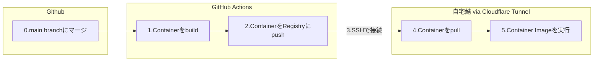

## はじめに
自分は身内で使うdiscord用のBOTを作って自宅鯖で動かしているのだが、最近書いたコードを実行先の環境に移すのが手間になってきた。
よって個人開発環境のCI/CDを整備することにした。

その一環として、ビルドしたコンテナを自宅サーバーにデプロイすることを計画している。

実現方法として、GitHub Actions上でコンテナをビルドし、自宅サーバーにSSH接続してコンテナリポジトリからpullする構成を作ってみることにした。



この記事では、GitHub Actionsから自宅サーバーへのSSH接続部分について備忘録として記載する。

## Cloudflare Tunnelとは
Cloudflare社が提供する、外部からの直接的なアクセスなしにローカルサーバーを公開できるサービス。
ngrokみたいなもの。
https://developers.cloudflare.com/cloudflare-one/connections/connect-networks/

このサービスの一部に、クレデンシャルレス、自前ドメイン不要でローカルサーバーを公開する`trycloudflare` という機能もあるが、今回はそれを使わずに安定的なトンネルを作成する方針にする。
`trycloudflare`については以下に試してみたことをまとめている。
https://zenn.dev/z4ck_key/articles/trycloudflare-verification

## 使用するバージョン

```bash
[masked]@vm-dockerhost-discordbot-dev-prxmx-01:~$ cloudflared -v
cloudflared version 2025.1.0 (built 2025-01-07-1219 UTC)
```

## Cloudflare Tunnelのセットアップ

Cloudflare Tunnelの設定方法はダッシュボードのGUIからやる方法とCLIとconfigファイルベースでやる方法の二種類ある。

楽なのは圧倒的にCLIベースなのだが、管理の一元化の観点からダッシュボードからやる方法を採用した。

### Tunnelの作成

1. Zero Trust > Network > Tunnlesから、「トンネルを作成する」を選択
  
2. Cloudflaredを選択
  
3. Tunnelの名前を入力する。
  
4. 表示されたインストールコマンドをコピーしておいて、「次へ」を選択する。
  
5. 「パブリックホスト名」で SSH 接続で使用したいドメインを入力し、「Type: SSH」「URL: localhost:22」を入力する。
  
6. 「トンネルを保存」を選択する。


### Service Tokenの作成

Service Tokenは、Cloudflare Zero Trustの機能の一つで、APIやサービス間の認証に使用される認証情報のこと。
人間のユーザーではなく、プログラムやサービスがCloudflareのリソースにアクセスする際に使用する。

今回のケースでは、GitHub ActionsからCloudflare Tunnelに接続する際の認証に使用する。

https://developers.cloudflare.com/cloudflare-one/identity/service-tokens/

1. Cloudflare Dashboard のメニューから 「Zero Trust」 > 「Access」 > 「サービス認証」 から、「サービストークンを作成する」を押す。
  
2. 「サービストークン名」を入力し、「サービストークンの有効期間」を選択して「トークンを作成する」を押す
  
3. Service Token が作成され、「Client ID」「Client Secret」が表示されるので、コピーしておく
  

### Access (Policy, Application)の作成

#### Policy

1. Access > ポリシー > 「ポリシーを追加する」 を選択
  
2. Policy 設定を入力し、以下を入力
    - 「ポリシー名」を入力
    - 「Action: Service Auth」
    - 「ルールを追加する」で「セレクタ: Service Token」「値」で作成した Service Token を選択
    
3. 保存を押す

#### Application

1. Access > アプリケーション > 「アプリケーションを追加する」を押す
2. 「セルフホスト」を選択する
  
3. 「アプリケーション名」「セッション時間」を入力し、「パブリックホスト名を追加」を押す
    - 「パブリックホスト名」にTunnel で入力したドメインを入力する
      
4. ポリシータブに移動
5. 先ほど作成したポリシーを適用する
  
6. アプリケーションの保存を選択


## デプロイ先サーバーの設定

### cloudflaredのインストール

Tunnel作成時に表示されていたインストールコマンドをデプロイ先サーバーで実行する

```bash
curl -L --output cloudflared.deb https://github.com/cloudflare/cloudflared/releases/latest/download/cloudflared-linux-amd64.deb && 

sudo dpkg -i cloudflared.deb && 

sudo cloudflared service install [TOKEN]
```

### Tunnelの接続

Tunnelの設定とcloudflaredのインストールが正常に成功していたら、画像下のように`Healty` と表示されるのでこれを確認する。


## ssh公開鍵の設定

Github Actionsからパスワード無しでSSHを張るために、それ用のキーペアを作成する。

以下のコマンドをローカルで実行。

ここで作成された秘密鍵は、後ほどGithubに登録するので控えておく。

```bash
ssh-keygen -t ed25519 -f ~/.ssh/github_actions -C "github-actions"
ssh-copy-id -i ~/.ssh/id_rsa.pub user@server-ip
```

## Github Actionsの設定

### ワークフローファイルの作成

`~/.github/workflows/`に以下の`ymlファイル` を作成

```bash
on:
  workflow_dispatch: # Webから手動実行可能にするトリガー

jobs:
  sample:
    name: SSH Test
    runs-on: ubuntu-latest
    env:
      SSH_PROXY_COMMAND: /tmp/cloudflared/cloudflared access ssh --id ${{ secrets.CLOUDFLARED_SSH_ID }} --secret ${{ secrets.CLOUDFLARED_SSH_SECRET }} --hostname %h
    steps:

      - name: Install cloudflared
        run: |
            lastest_version=$(curl -s $GITHUB_API_URL/repos/cloudflare/cloudflared/releases/latest | jq -r '.tag_name')
            mkdir -p /tmp/cloudflared
            curl -sL -o /tmp/cloudflared/cloudflared $GITHUB_SERVER_URL/cloudflare/cloudflared/releases/download/$lastest_version/cloudflared-linux-amd64
            chmod +x /tmp/cloudflared/cloudflared
            /tmp/cloudflared/cloudflared --version 
      - name: Set up SSH key
        run: |
            mkdir -p ~/.ssh
            echo "${{ secrets.SSH_PRIVATE_KEY }}" > ~/.ssh/id_rsa
            chmod 600 ~/.ssh/id_rsa

      - name: Run SSH command and whoami
        run: |
          ssh -i  ~/.ssh/id_rsa -o StrictHostKeyChecking=no -o ProxyCommand="$SSH_PROXY_COMMAND" [username]@[target-domain.com] whoami

```

:::message
Install cloudflared Stepにあるように、cloudfalredをGithub Actions Runner側にも導入する必要があることに注意。
`SSH_PROXY_COMMAND` としてcloudflaredを叩く必要がある。（一敗）
:::
## シークレットの設定

`CLOUDFLARED_SSH_ID` 、`CLOUDFLARED_SSH_SECRET` 、`SSH_PRIVATE_KEY` をGithub Actions secrets に登録する。

`CLOUDFLARED_SSH_ID` と`CLOUDFLARED_SSH_SECRET` はそれぞれService Tokenを作成したときに発行されたIDとSecret。

## 結果

以下のような実行結果がGithub Actionsから得られた。

```bash
Run ssh -i  ~/.ssh/id_rsa -o StrictHostKeyChecking=no -o ProxyCommand="$SSH_PROXY_COMMAND" [username]@[target-domain.com] whoami
[username]
```

## まとめ

- Cloudflare Tunnelを使って自宅サーバーのSSHを公開した。
- 自宅サーバーへGithub ActionsからSSHしてコマンドを叩けた。
- NextActionは以下
    - Github Actions上でコンテナをビルドする
    - Github Actions上でコンテナをコンテナリポジトリにpush
    - Github Actionsから自宅サーバー内でコンテナをpullするコマンドを実行