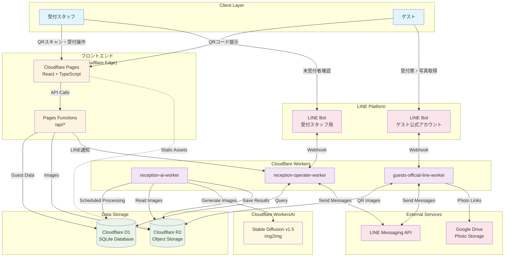
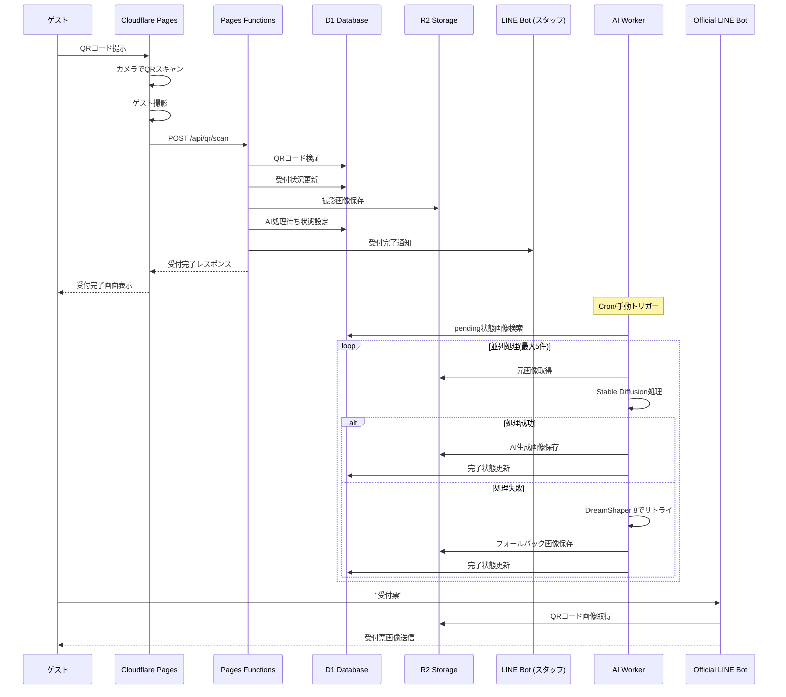
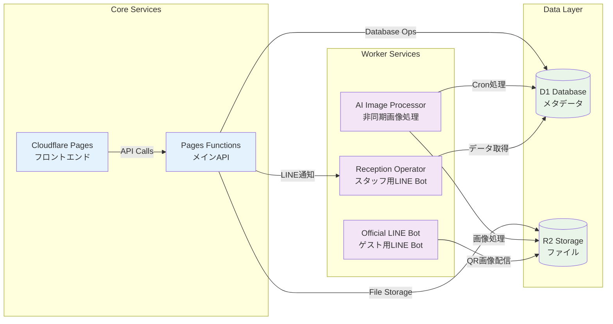
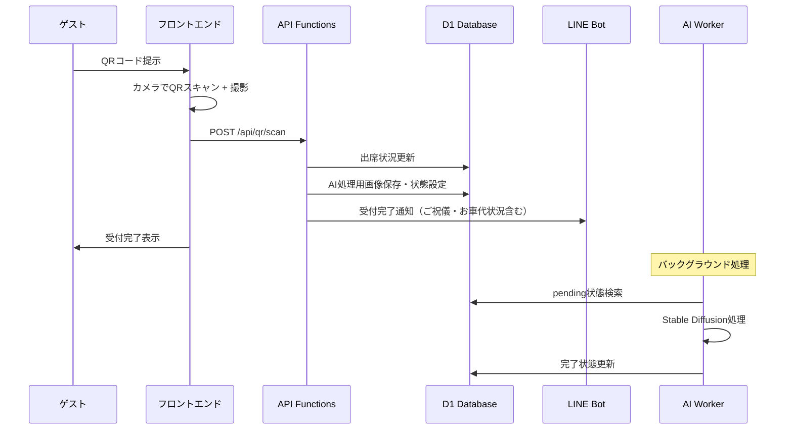

## はじめに
私事ではあるが、今年の 7 月某日に結婚式を挙げた。  

以前社内 LT 会で、先輩社員が自身の結婚式の余興で使うアプリを自作したという話を聞いたことがあり、自分の結婚式ではなにか作りたいと考えていた。  
その作ってみたい欲の解消 + どうせ作るなら結婚式における事務処理フローを効率化しようというモチベーションで「QR コードを使った受付管理システム」を作成することにした。  
なお、本来は受付管理の他にも、ゲストの顔写真を撮って AI によるイラスト化処理を挟んで公式 LINE を通してゲストに配布する、という機能も作っていた。  
しかし生成するイラストのクオリティを上げきれずに本番では使用しなかった。残念。  

この記事は作ったシステムの供養兼、やったことの備忘録のようなものである。

## システム概要

このシステムは、以下の機能を実現するもの。

- **ゲスト向け受付機能**
  -  QR コードによるシームレスな受付処理
  -  受付完了したゲストに対する、メッセージモーダル表示
- **オペレーター向け受付機能**
  - LINE 経由での受付スタッフへの状況通知
  - ご祝儀受取状況、お車代の受け渡し要不要の通知
- **記念イラスト作成**
  - AI 生成によるイラスト自動作成（最終的に使わず）
  

## システムの見た目
### ゲスト側
ゲストは、事前配布された QR コードをカメラに翳すことで受付が完了する。  
受付完了時は、サンクスモーダルが表示される。  
筆者はフロントエンドが（というかデザインが）苦手なので、ここらへんの実装はすべて ClaudeCode 君にお任せした。  
いい時代になったものだ。  

### オペレーター側
ゲストがシステムで受付を完了すると、以下のような通知が受付スタッフ用の公式 LINE に飛んでくる。  
受付スタッフはこれを見てお車代を渡したり、ご祝儀を受け取ったりできる。  
本来は LINE 上から QuickReply 機能を使って DB に情報を push したかったが、後述の[制限](#official-line-backendの制限)によってできなかった。
ついでに、LINE のリッチメニューを押すと後何人受付が完了していないかを確認する機能も実装している。  


## アーキテクチャ構成
今回作成した構成図やデータフロー図を記す。   
基本的にすべて Cloudflare Platform のマネージドサービスで構成している。  
選定理由は使い慣れていたからというのと、**Cloudflare WorkersAIを使ってみたかった**から。  
しかし、この判断が後々結構な大変な目に合う原因を作ることになる。  
:::message alert
自分は使い慣れていたからという理由で Cloudflare Pages を使用したが、2025/07/18 現在の時点で Cloudflare Pages の利用は非推奨となっている。  
Cloudflare Workers の使用が案内されているので、これから新規で作る場合は特に理由がない限り Cloudflare Workers を使うのがよい。
:::

### 全体システム構成図



### データフロー詳細図



### サービス間連携図


### フロントエンド・API層
```
React + TypeScript アプリケーション (Cloudflare Pages)
├── QRスキャナー機能 (getUserMedia API)
├── Material-UI による レスポンシブデザイン
└── /api/* エンドポイント (Cloudflare Pages Functions)
```

### データ・ストレージ層
```
Cloudflare D1 Database
├── ゲスト情報・受付状況管理
├── AI処理ステータス管理
└── LINE連携情報

Cloudflare R2 Storage
├── QRコード画像
├── 受付時撮影画像
└── AI生成ウェディングポートレート
```

### Cloudflare Workers サービス群

システムの中核となる 3 つの Worker で機能を分散処理している。

## 各サービスの詳細

### 1. AI Image Processor (`reception-ai-worker`)

#### 役割: 
受付時の撮影画像の自動 AI 処理。

```typescript
// 主要機能
- 受付時撮影画像からウェディングポートレート生成
- Cron-based 非同期処理パイプライン


// 技術スタック
AI Models: Stable Diffusion v1.5 img2img or DreamShaper 8 LCM
Processing: Database状態管理 + 自動リトライ機能
Storage: Cloudflare R2 への自動保存
```

#### **処理フロー**:
1. 受付時に撮影された画像を DB で `ai_status: 'pending'` として管理
2. Cron Trigger で処理待ちを検索
3. AI 画像生成・R2 保存・DB 状態更新を並列実行
4. 失敗時は自動リトライ（最大 3 回）

### 2. Reception Operator Worker (`reception-operater-worker`)

#### 役割: 
受付スタッフ用 LINE BOT。

```typescript
// 主要機能
- 未受付者一覧のリアルタイム確認
- LINE経由での受付状況モニタリング

// 対応コマンド
"受付未完了者一覧" → 未受付ゲストの名前一覧を即座に返信
```

#### レスポンス例:
```
【未受付者一覧】

田中太郎
佐藤花子
山田次郎

未受付者: 3名
```

### 3. Guests Official LINE Worker (`guests-official-line-worker`)

#### 役割:
ゲスト向け公式 LINE BOT。

```typescript
// 主要機能
- 受付チケット（QRコード画像）配信
- 席次表URL生成・配布
- ゲストの属性ベースの個別対応

// 対応メッセージ
"受付票"   → QRコード画像を送信
"写真置き場" → 個人情報が必要以上に流出しないよう属性別GoogleDriveフォルダURL
"席次表"   → 個人情報が必要以上に流出しないよう属性別別席次表URL
 その他必要なカスタムレスポンス

```

## 受付フロー全体像



## 技術的に詰まったところ
### Official LINE Backendの制限
当初、ゲストに配信する Official LINE のバックエンドは以下の2種類だった。  
- 本受付システムに生えている API
- 受付処理が関係ないカスタムレスポンスを返す Worker  

しかし、構築中に Official LINE のバックエンドは**一箇所しか設定できない**ことが発覚。  
正しくは、Official LINE に設定する Webhook URL を1つしか設定できないために、LINE 上の Message を受け取れるバックエンドが1つだけだった。 

回避策としては、処理をできるだけ Worker に寄せたのと、一方的に LINE に配信するだけならどこからでも API を叩けるので、単一方向の通知は Worker とは別の場所から叩いた。  
LINE の QuickReply 機能を使って DB を UPDATE する機能は、この制限（と時間的制約）によってオミットされた。残念。
### Workerの処理順制御
本来やりたかった処理は、Clouflare Queses を使ったキューイング処理だった。  
https://developers.cloudflare.com/queues/
フロントエンドで画像保存→Clouflare Queses で Job 管理→Clouflare Queses を参照して AI 画像処理を行う Worker が起動、という流れ。  
しかし、Clouflare の Free Plan では Clouflare Queses がサポートされておらず、Paid Plan 限定だった。痛恨の確認ミス。  
別に大した金額でもなかったので払っても良かったのだが、どうせなら無料枠の中で泳ぎきりたかったので、Cron Trigger 機能でバッチ処理する方向に転換した。
### Clouflare WorkersAIによるimg2img処理
本システムで一番やりたかったこと。  そしてクオリティが上げきれずに泣く泣く断念したことでもある。  
Cloudflare WorkersAI とは、Cloudflare のグローバルネットワーク上に用意されているモデルをサーバーレスで利用できる機能。  
使用できるモデル一覧はこれら。
https://developers.cloudflare.com/workers-ai/models/
今回は img2img で写真をイラスト調にしたかったのだが、そもそも img2img を出来るモデルが少なかった。  
Wisper 系のモデルや、テキスト生成系のモデルが多い印象。  
画像生成系のモデルも基本的に StableDiffusion 系ばかりで、好みの画風を出そうとするとプロンプトエンジニアリングを頑張ることになってしまった。  
よって、StableDiffusion が得意な写実系の表現は出来るが、そこから離れると生成される画像がすごいことになって使用に耐えないという判断になった。  
[LoRA Adapter](https://developers.cloudflare.com/workers-ai/features/fine-tunes/loras/
)という機能もあり、自前のアダプターファイルを使用して LoRA することも出来るようなのだが、これも[使用できるモデル](https://developers.cloudflare.com/workers-ai/models/?capabilities=LoRA)に制限があり、img2img 用途では適さなかった。  
text2img ならできそうだったので、一応要件が異なれば希望は感じる。
### iPadへのレスポンシブ対応
自分がフロントエンドをあまり触らないマンなので、トラシューが追いつかなかった部分。  
本システムではサンクスモーダルを**Material-UI (MUI) の Dialog コンポーネント**で実装しているのだが、これが iPad Pro 上の Safari だと何故か表示されなかった。  
Windows 上の Chrome や Mac 上の Chrome、Safari では表示されたから、iPadOS の問題？  
これに関してはどこかに知見が転がっていそうだったが、シンプルに受付に使う端末を iPad→Mac に変更することで回避した。  
やっぱりフロントエンドは苦手だ。

## 残存バグ
本システムは QR コードをフロントエンドで読み込むことを処理の起点にしている。  
なにも気にしないとカメラに QR コードが移り続ける限り API を叩きまくるので、1回 QR コードを読み込むと 5s 間の Cold 処理を入れている。  のだが、  
どうやらこの処理が悪さをして長時間起動しっぱなしにしていると、一生 Cold 状態から帰ってこなくなるバグが残っていた。  
結婚式直前で時間がない中開発していてテストケースを網羅できていない自覚はあったので、受付スタッフは僕の友人のエンジニアを配置しておいた。  
何かあったらなんかいい感じにカバーしといて（雑なお願い）  
結果的に、受付中にバグが発生したけどブラウザをリロードしたら初期化されて事なきを得たみたい。  
やはりフォールバック手段を用意するのは大事。  
わかる人間を配置することをフォールバックと呼ぶのかという問題は意図的に無視することにする。

## やり残したこと
本当はゲストに渡す QR コードも ControlNet とかを使って派手なものにしたかった。  こんなやつ。
https://chizaizukan.com/news/5WydCm1YVpFl9piO6YKjhk/
シンプルに時間が足りなくて断念。  
自宅鯖上に StableDiffusion と ControlNet が動くようにしておいて、Clouflare Tunnel とかで HTTP API のエンドポイントを建てたものを叩きに行ったら実現できるかなぁとか考えていたけど、実装を具体化するところまでもいかなかった。どっかで再挑戦したい。  
これができれば、WorkersAI から脱却して img2img もできるようになると思われるので、（LoRA とか自由に使えるし）、時間があればやってみたかった。  
けどまぁ、結婚式準備で時間が余ることなんてないだろうから結局手が回らなかった気もする。  

## まとめ

今回、自分の結婚式で使用する受付システムを Cloudflare のフルスタック構成で構築してみた。  
Cloudflare Workers ベースのマイクロサービスちっくなアーキテクチャや、Cloudflare WorkersAI 周りの使用を触れることができた。  
次似たようなものを作ることがあったら、画像生成周りをもっと強化したいと思う。  

なお、こんなシステムを作っていたせいで結婚式の準備自体は稼働が足りなくなって前日の深夜まで作業することになった。  
リソースの割り振り先はちゃんと考えた方が良い。